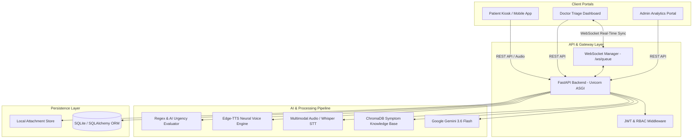

# 🏥 Sanjeevani AI — Smart Multilingual Triage & Outpatient Prioritization

[](https://fastapi.tiangolo.com)
[](https://ai.google.dev/)
[](https://developer.mozilla.org/en-US/docs/Web/API/WebSockets_API)
[](https://www.trychroma.com/)
[](https://opensource.org/licenses/MIT)

> **Smart India Hackathon (SIH)** — An intelligent, voice-enabled, multimodal clinical triage platform that streamlines emergency and OPD hospital queues through multilingual patient intake, RAG-guided clinical interview trees, deterministic red-flag detection, and live doctor queues.

---

## 📑 Table of Contents
1. [Problem Statement & Solution](#-problem-statement--solution)
2. [Key Features](#-key-features)
3. [System Architecture](#-system-architecture)
4. [Tech Stack](#-tech-stack)
5. [Directory Structure](#-directory-structure)
6. [Getting Started & Installation](#-getting-started--installation)
7. [Application Portals & Usage](#-application-portals--usage)
8. [API Documentation](#-api-documentation)
9. [Resilience & Fallback Mechanism](#-resilience--fallback-mechanism)
10. [License & Acknowledgments](#-license--acknowledgments)

---

## 🎯 Problem Statement & Solution

### The Challenge
Hospital Outpatient Departments (OPD) and Emergency Rooms (ER) face severe overcrowding, prolonged patient wait times, and manual, high-stress triage processes. Patients frequently struggle to express symptoms due to language barriers, stress, or literacy constraints, while clinicians lack structured, pre-consultation clinical histories.

### The Solution
**Sanjeevani AI** automates patient registration and triage prior to seeing the doctor:
- **Patients** interact via voice or text in their native regional language (Telugu, Hindi, Tamil, Kannada, Bengali, English, etc.).
- **Clinical AI Engine** gathers structured symptom history (onset, character, radiation, severity) and generates SBAR-compliant clinical summaries.
- **Urgency Classifier** prioritizes emergent cases automatically (Chest Pain, Stroke, Respiratory Distress) to prevent critical delays.
- **Clinicians** receive real-time, WebSocket-synchronized queue reordering with comprehensive patient dossiers.

---

## ✨ Key Features

### 🗣️ Multilingual Voice & Conversational Intake
- **Voice-Enabled STT & TTS:** High-accuracy Speech-to-Text via Gemini Multimodal Audio / Whisper and natural voice playback via Edge-TTS across 10+ Indian languages.
- **Adaptive Clinical RAG:** Vector-driven diagnostic question retrieval powered by ChromaDB medical guidelines.
- **Attachment & Report Upload:** Ingest prescriptions, ECGs, wound photos, or lab reports directly into the case record.
- **Offline Draft Protection:** Auto-saves intake progress to prevent session loss on network interruptions.

### ⚡ Dual-Tier Urgency & Prioritization Engine
- **Deterministic Red-Flag Filter:** Regex-based sub-millisecond screening for life-threatening emergencies.
- **LLM Clinical Classifier:** Gemini 3.6 Flash deep triage classification (`EMERGENT`, `URGENT`, `SEMI-URGENT`, `NON-URGENT`) with a 1–100 urgency score.
- **Automated Specialty Routing:** Directs cases to General Medicine, Cardiology, Pulmonology, Orthopedics, Neurology, Pediatrics, etc.

### 🩺 Real-Time Doctor Triage Dashboard
- **Live WebSocket Queue:** Instant real-time updates as new patients complete intake or when urgency priorities change.
- **Color-Coded Urgency Badging:** Visual flags (`EMERGENT` in pulsing red, `URGENT` in orange, `SEMI-URGENT` in yellow, `NON-URGENT` in green).
- **Comprehensive Patient Dossier:** View SBAR clinical summaries, verbatim transcripts, attachments, and medical history.
- **Manual Priority Override & Notes:** Doctors can reorder queue positions and append consultation findings.

### 📊 Hospital Administration & Analytics
- **Executive Operational KPIs:** Live throughput metrics, urgency distribution, average wait times, and department load.
- **Role-Based Access Control (RBAC):** Secure JWT-authenticated staff management for Doctors, Triage Nurses, and Administrators.

---

## 🏗️ System Architecture



---

## 💻 Tech Stack

| Domain | Technology |
|---|---|
| **Backend Framework** | [FastAPI](https://fastapi.tiangolo.com/) (Python 3.10+) |
| **ASGI Server** | [Uvicorn](https://www.uvicorn.org/) |
| **LLM Intelligence** | [Google Gemini 3.6 Flash](https://ai.google.dev/) via `google-genai` SDK |
| **Vector Database (RAG)** | [ChromaDB](https://www.trychroma.com/) |
| **Voice & Audio Processing** | Gemini Multimodal Audio, OpenAI Whisper, Microsoft `edge-tts` |
| **Database & ORM** | SQLite3, [SQLAlchemy](https://www.sqlalchemy.org/) |
| **Real-Time Layer** | Native WebSockets (`FastAPI WebSocket`) |
| **Resilience & Backoff** | [Tenacity](https://tenacity.readthedocs.io/) Exponential Retry Decorators |
| **Frontend Interfaces** | Vanilla HTML5, Modern CSS3 (Glassmorphism & CSS Variables), JavaScript ES6+ |

---

## 📁 Directory Structure

```text
SIH/
├── backend/
│   ├── main.py                 # FastAPI application factory & lifespan setup
│   ├── database.py             # SQLite engine & database session setup
│   ├── models.py               # SQLAlchemy ORM schemas (Patient, Case, Queue, Staff)
│   ├── requirements.txt        # Python dependency specifications
│   ├── Dockerfile              # Container deployment file
│   ├── docker-compose.yml      # Orchestration config
│   ├── routers/
│   │   ├── auth.py             # Staff login & JWT authentication
│   │   ├── chat.py             # Patient intake chat, audio upload & submission
│   │   ├── doctor.py           # Doctor queue management & case review
│   │   └── admin.py            # Operational analytics & staff CRUD
│   ├── services/
│   │   ├── ai_service.py       # Gemini conversational intake & clinical summary RAG
│   │   ├── stt_service.py      # Speech-to-text audio transcription
│   │   ├── tts_service.py      # Multilingual text-to-speech engine
│   │   ├── urgency_service.py  # Dual-tier red-flag and triage classification
│   │   └── auth_service.py     # Password hashing & JWT generation
│   └── uploads/                # Patient image & lab attachment storage
├── frontend/
│   ├── patient.html            # Patient registration, voice intake & summary kiosk
│   ├── doctor.html             # Real-time doctor triage queue & case examination
│   ├── admin.html              # Hospital analytics, KPIs & staff management
│   └── index.html              # Landing portal & navigation hub
├── tests/                      # Automated unit & integration tests
├── .env.example                # Sample environment variables template
├── .gitignore                  # Git exclusions file
├── PRD_IMPLEMENTED.md          # Comprehensive as-built specification document
└── README.md                   # Project documentation
```

---

## 🚀 Getting Started & Installation

### 1. Prerequisites
- **Python 3.10+** installed on your system.
- **Git** version control.
- A **Google Gemini API Key** (get one free at [Google AI Studio](https://aistudio.google.com/)).

### 2. Clone Repository
```bash
git clone https://github.com/tejeswari1489/sih2026.git
cd sih2026
```

### 3. Create & Activate Virtual Environment
```bash
# Windows
python -m venv backend/venv
backend\venv\Scripts\activate

# Linux / macOS
python3 -m venv backend/venv
source backend/venv/bin/activate
```

### 4. Install Dependencies
```bash
cd backend
pip install -r requirements.txt
```

### 5. Configure Environment Variables
Create a `.env` file inside the `backend/` directory:
```env
GEMINI_API_KEY="YOUR_GOOGLE_GEMINI_API_KEY"
GEMINI_MODEL="gemini-3.6-flash"
SECRET_KEY="your-super-secret-jwt-signing-key"
DATABASE_URL="sqlite:///./sih.db"
```

### 6. Run the Application
```bash
# From the backend directory:
uvicorn main:app --reload --reload-exclude 'venv/*' --reload-exclude 'sih.db' --reload-exclude 'uploads/*'
```

The server will initialize SQLite database tables and start listening at `http://localhost:8000`.

---

## 🌐 Application Portals & Usage

| Portal | URL | Description |
|---|---|---|
| 🩺 **Patient Intake Kiosk** | `http://localhost:8000/frontend/patient.html` | Multilingual registration, interactive voice/text triage chat, and summary review. |
| 👨‍⚕️ **Doctor Dashboard** | `http://localhost:8000/frontend/doctor.html` | Real-time prioritized patient queue, SBAR clinical dossiers, and queue reordering. |
| 📊 **Admin Analytics** | `http://localhost:8000/frontend/admin.html` | Operational KPI metrics, department throughput charts, and staff management. |
| 📖 **Interactive API Docs** | `http://localhost:8000/docs` | Swagger UI documentation for all REST endpoints. |

---

## 🔌 API Documentation

### Core Endpoints

#### Patient Intake (`/chat`)
- `POST /chat/start` — Initializes a new intake session with patient demographics and retrieved RAG context.
- `POST /chat/message` — Handles conversational turns and advances clinical questions.
- `POST /chat/transcribe` — Transcribes incoming user voice recordings into text.
- `POST /chat/tts` — Synthesizes AI clinical responses into regional language audio.
- `POST /chat/upload-attachment` — Uploads medical photos, prescriptions, or lab test images.
- `POST /chat/finish` — Concludes the conversation and generates the SBAR clinical summary.
- `POST /chat/submit` — Saves the final case, computes urgency flags, and broadcasts to the doctor queue.

#### Doctor Management (`/doctor`)
- `GET /doctor/queue` — Fetches current prioritized patient queue.
- `GET /doctor/case/{id}` — Retrieves full clinical details, transcript, and attachments for a case.
- `POST /doctor/case/{id}/review` — Marks a case as reviewed and records doctor notes.
- `POST /doctor/queue/reorder` — Manually adjusts patient priority in the queue.

#### Real-Time Sync (`/ws`)
- `WebSocket /ws/queue` — Real-time event stream broadcasting queue updates, priority changes, and intake submissions.

---

## 🛡️ Resilience & Fallback Mechanism

- **Zero-Downtime Multi-Lingual Fallback**: When Gemini API quotas (429/503) are temporarily exhausted, the intake chat automatically switches to a localized rule-based question bank (English, Telugu, Hindi, Tamil, Kannada, Bengali) so patient intake never halts.
- **Deterministic Red-Flag Safety**: Critical conditions (e.g., cardiac chest pain, stroke, severe respiratory distress) trigger immediate `EMERGENT` flags via regex pattern matching without relying solely on network connectivity.
- **Exponential Retry Backoff**: Network calls to LLM APIs are guarded by `tenacity` retry decorators with exponential backoff.

---

## 📄 License & Acknowledgments

This project was built for the **Smart India Hackathon (SIH)**.  
Released under the [MIT License](LICENSE).
